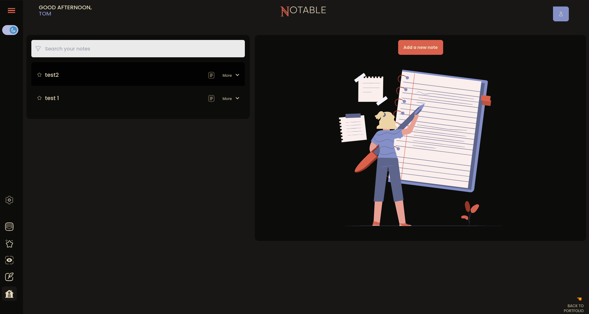

# Notable

<br>



<br>

A note-taking web app built as a university project. Laravel 11 backend, Postgres database, Livewire/Alpine.js + Tailwind on the frontend, all running in Docker.

The main feature: you paste an image of handwritten or printed notes and the app returns them as clean Markdown. It uses an OpenAI-compatible vision model (OpenRouter in this case, but the endpoint is configurable) to extract and format the text.

## Stack

- Laravel 11 / PHP 8.3
- PostgreSQL 16
- Alpine.js, Tailwind CSS, Vite
- Docker Compose for dev and prod

## Running locally

### 1. Clone the repo and copy `.env`

```bash
git clone <repo-url> notable
cd notable
cp .env.example .env
```

### 2. Fill in the placeholders in `.env`

Open `.env` and replace the `#set_...` placeholder values:

- **`DB_PASSWORD`** (required) — generate with `openssl rand -base64 24`. This is the password Postgres uses to initialize the database on first run **and** the password Laravel uses to connect — the two must match. Must be set before the first `docker compose up`, because Postgres only reads `POSTGRES_PASSWORD` during data directory initialization. After that, changing the value will break the connection.
- **`AI_API_KEY`** — your OpenRouter API key, or any other OpenAI-compatible service.
- **`AI_MODEL`** — the model identifier, e.g. `google/gemma-4-26b-a4b-it` for OpenRouter.
- **`AI_ENDPOINT`** — already set to `https://openrouter.ai/api/v1/chat/completions`. Change it if you're using a different provider.
- **`APP_KEY`** — leave as `#generated_by_artisan` for now. The container entrypoint runs `php artisan key:generate` on first start and writes the result back to this file. (After first run it will be a real `base64:...` value.)
- **Mail settings** (`MAIL_USERNAME`, `MAIL_PASSWORD`, `MAIL_FROM_ADDRESS`) — placeholders. Fill them in if you want real email to work, or skip and use `MAIL_MAILER=log` to write emails to the log file instead. `MAIL_PASSWORD` expects a [Google app password](https://myaccount.google.com/apppasswords), not your account password.

### 3. Verify `compose.override.yml` is present

`compose.override.yml` is committed and ships with the repo. It flips the prod hardening off (`read_only: false`) and bind-mounts your source tree into the container so edits on the host are visible without rebuilding. You shouldn't need to touch it for a default local run.

If you ever need to start fresh or you accidentally removed it, here's the minimum content:

```yaml
services:
  notable-app:
    read_only: false

    volumes:
      - "./storage:/var/www/html/storage:rw"
      - "./app:/var/www/html/app:rw"
      - "./bootstrap:/var/www/html/bootstrap:rw"
      - "./config:/var/www/html/config:rw"
      - "./database:/var/www/html/database:rw"
      - "./resources:/var/www/html/resources:rw"
      - "./routes:/var/www/html/routes:rw"
      - "./public:/var/www/html/public:rw"
      - "./.env:/var/www/html/.env:rw"
```

### 4. Build and start

```bash
docker compose up --build
```

The app is at `http://localhost:9001`. The Postgres data directory at `docker_services/db_service/pg_data/` is gitignored, so a fresh clone always starts with an empty database.

For live CSS reload, run in a second terminal:

```bash
npm install
npm run dev
```

## Deploying to the VPS

1. Clone the repo on the server.

1. Place a production `.env` at the project root (with a real `APP_KEY` and prod database credentials).

1. Run the prep script, which handles the rest:

   ```bash
   ./prep4prod.sh
   ```

The script removes the dev override, sets prod env values, patches the entrypoint, builds, and waits for the stack to be healthy.

## Project layout

- `app/Http/Controllers/ImageToMarkdownController.php` — the vision/OCR endpoint
- `app/Http/Controllers/ImageOptimisationController.php` — server-side image resize
- `app/Notable/` — domain code (forms, routes, controllers grouped by feature)
- `routes/web.php` — web routes, including the `/note-images/...` streaming route that replaces Laravel's `storage:link`
- `notable-entrypoint` — the container entrypoint script
- `compose.yml` / `compose.override.yml` — production and dev compose files
- `prep4prod.sh` — production deployment helper

## Notes

This is a school project and a proof of concept. It is not a SaaS, not production-hardened beyond what's needed for the demo deployment, and not intended for multi-tenant use.

## License

MIT. See [LICENSE](LICENSE).

